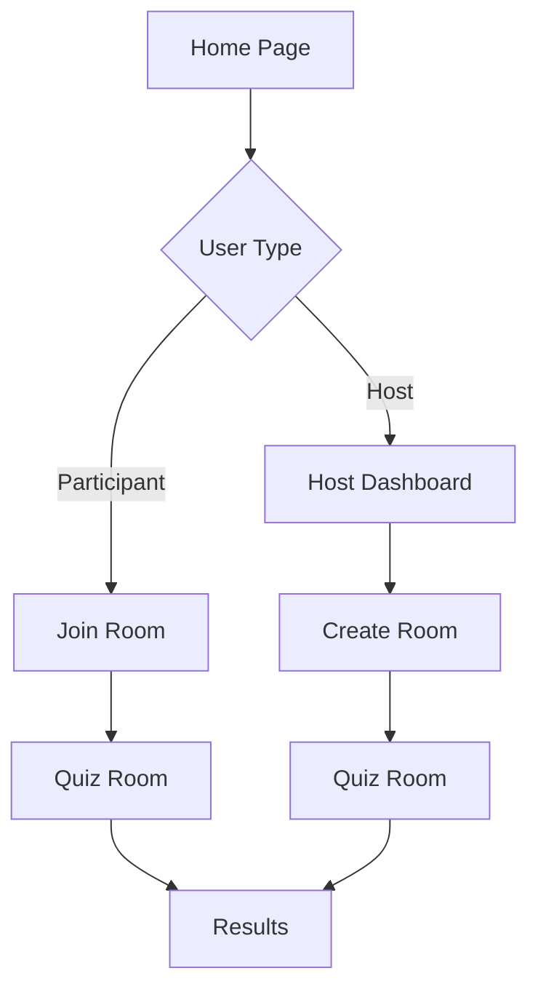

## 1. Product Overview
RitualQuiz is a real-time quiz platform that allows users to create and host quiz events where multiple participants can join and compete. The platform enables interactive quiz experiences for educational, entertainment, or team-building purposes.

Users can create quiz rooms, invite participants, and conduct live quiz sessions with real-time scoring and leaderboards. The platform targets educators, event organizers, and social groups looking for engaging quiz experiences.

## 2. Core Features

### 2.1 User Roles
| Role | Registration Method | Core Permissions |
|------|---------------------|------------------|
| Participant | Email registration | Join quiz rooms, answer questions, view scores |
| Host | Email registration | Create quiz rooms, manage questions, control quiz flow, view analytics |

### 2.2 Feature Module
Our quiz platform requirements consist of the following main pages:
1. **Home page**: hero section, navigation, quiz room list, create room button.
2. **Quiz room page**: participant list, question display, answer options, timer, scoreboard.
3. **Host dashboard**: room management, question editor, participant monitoring, quiz controls.
4. **Profile page**: user information, quiz history, statistics.

### 2.3 Page Details
| Page Name | Module Name | Feature description |
|-----------|-------------|---------------------|
| Home page | Hero section | Display platform branding and call-to-action buttons for joining or creating quizzes. |
| Home page | Navigation | Top navigation bar with login/logout, profile access, and quiz room list. |
| Home page | Quiz room list | Show active quiz rooms with participant count and join buttons. |
| Home page | Create room | Button to create new quiz room with room settings. |
| Quiz room | Room info | Display room code, participant count, and current question number. |
| Quiz room | Question display | Show current question with large, readable text and optional images. |
| Quiz room | Answer options | Multiple choice buttons with immediate feedback on selection. |
| Quiz room | Timer | Countdown timer for each question with visual progress indicator. |
| Quiz room | Scoreboard | Real-time leaderboard showing top participants and their scores. |
| Host dashboard | Room management | Create/edit room settings, set quiz parameters and time limits. |
| Host dashboard | Question editor | Add/edit/delete questions with answer options and correct answers. |
| Host dashboard | Participant monitor | View all participants, their status, and individual scores. |
| Host dashboard | Quiz controls | Start/pause quiz, navigate between questions, end quiz session. |
| Profile page | User info | Display username, email, and account settings. |
| Profile page | Quiz history | List of past quiz participations with scores and dates. |
| Profile page | Statistics | Show total quizzes played, average score, and achievements. |

## 3. Core Process
**Participant Flow**: User visits homepage → browses available quiz rooms → enters room code or selects from list → waits for quiz to start → answers questions in real-time → views final results and leaderboard.

**Host Flow**: User logs in → navigates to host dashboard → creates new quiz room → adds questions and settings → shares room code with participants → starts quiz when ready → controls quiz flow → views final results and analytics.

## 4. User Interface Design

### 4.1 Design Style
- **Primary Colors**: Deep purple (#6B46C1) for primary actions, bright green (#10B981) for success states
- **Secondary Colors**: Light gray (#F3F4F6) for backgrounds, dark gray (#374151) for text
- **Button Style**: Rounded corners with subtle shadows, primary buttons in purple, secondary in gray
- **Font**: Modern sans-serif (Inter or similar), 16px base size with clear hierarchy
- **Layout**: Card-based design with consistent spacing, mobile-first responsive grid
- **Icons**: Material Design icons for consistency and clarity

### 4.2 Page Design Overview
| Page Name | Module Name | UI Elements |
|-----------|-------------|-------------|
| Home page | Hero section | Centered purple gradient background with white text, prominent CTA buttons below |
| Home page | Quiz room list | Card-based grid layout, each room shows title, participants, and join button |
| Quiz room | Question display | Large centered card with question text, 24px font size, high contrast |
| Quiz room | Answer options | Full-width buttons with hover effects, green for correct, red for incorrect |
| Quiz room | Scoreboard | Sidebar panel with participant avatars, names, and scores in descending order |
| Host dashboard | Room management | Form inputs with labels, toggle switches for settings, save button |
| Host dashboard | Question editor | Textarea for questions, input fields for options, radio buttons for correct answer |

### 4.3 Responsiveness
The platform is mobile-first with responsive design. Quiz rooms adapt from single-column mobile layout to multi-column desktop view. Touch interactions are optimized for mobile devices with appropriately sized buttons and swipe gestures for navigation.

### 4.4 3D Scene Guidance
Not applicable for this quiz platform application.