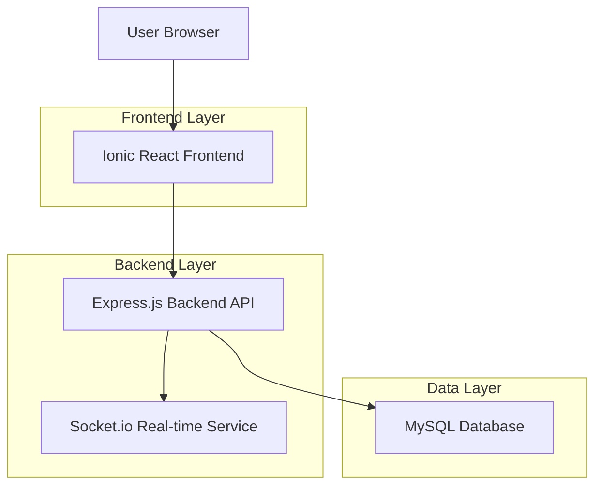
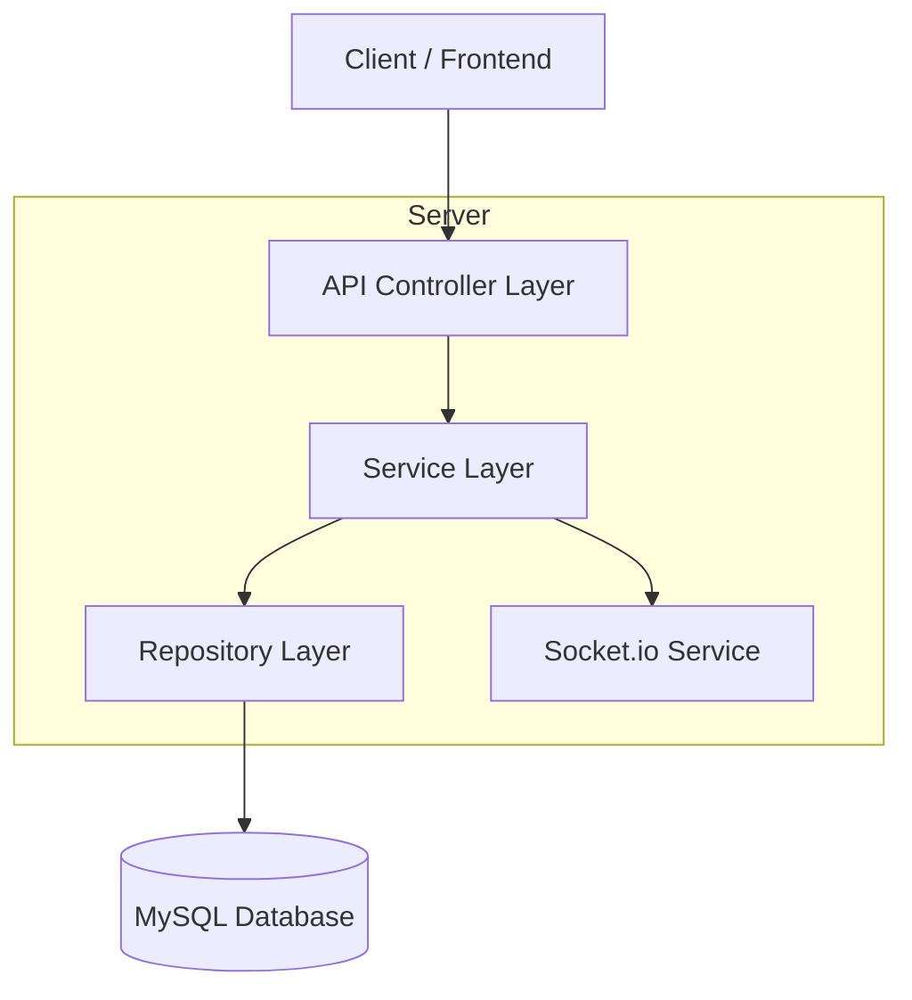
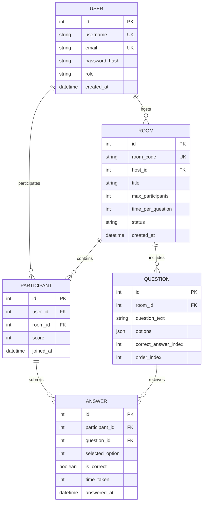

## 1. Architecture design



## 2. Technology Description
- Frontend: Ionic React@7 + TypeScript + Capacitor
- Backend: Express.js@4 + Node.js@18 + Socket.io
- Database: MySQL@8
- Initialization Tool: Ionic CLI
- Development Tools: Nodemon for backend auto-restart

## 3. Route definitions
| Route | Purpose |
|-------|---------|
| / | Home page with quiz room listings |
| /login | User authentication page |
| /register | User registration page |
| /quiz/:roomId | Active quiz room for participants |
| /host/dashboard | Host control panel for managing quizzes |
| /host/create | Quiz creation and room setup |
| /profile | User profile and statistics |
| /leaderboard/:roomId | Final results and leaderboard |

## 4. API definitions

### 4.1 Authentication APIs
```
POST /api/auth/register
```
Request:
| Param Name| Param Type  | isRequired  | Description |
|-----------|-------------|-------------|-------------|
| username  | string      | true        | Unique username |
| email     | string      | true        | User email address |
| password  | string      | true        | User password |

Response:
| Param Name| Param Type  | Description |
|-----------|-------------|-------------|
| success   | boolean     | Registration status |
| token     | string      | JWT authentication token |
| user      | object      | User data object |

```
POST /api/auth/login
```
Request:
| Param Name| Param Type  | isRequired  | Description |
|-----------|-------------|-------------|-------------|
| email     | string      | true        | User email address |
| password  | string      | true        | User password |

Response:
| Param Name| Param Type  | Description |
|-----------|-------------|-------------|
| success   | boolean     | Login status |
| token     | string      | JWT authentication token |
| user      | object      | User data object |

### 4.2 Quiz Room APIs
```
POST /api/rooms/create
```
Request:
| Param Name| Param Type  | isRequired  | Description |
|-----------|-------------|-------------|-------------|
| title     | string      | true        | Room title |
| maxParticipants | number | false   | Maximum participants (default: 50) |
| timePerQuestion | number | false   | Time per question in seconds |

Response:
| Param Name| Param Type  | Description |
|-----------|-------------|-------------|
| success   | boolean     | Creation status |
| roomCode  | string      | Unique room identifier |
| roomId    | string      | Internal room ID |

```
GET /api/rooms/:roomId/join
```
Request:
| Param Name| Param Type  | isRequired  | Description |
|-----------|-------------|-------------|-------------|
| roomId    | string      | true        | Room identifier |

Response:
| Param Name| Param Type  | Description |
|-----------|-------------|-------------|
| success   | boolean     | Join status |
| roomData  | object      | Room information and current state |

### 4.3 Question Management APIs
```
POST /api/questions/add
```
Request:
| Param Name| Param Type  | isRequired  | Description |
|-----------|-------------|-------------|-------------|
| roomId    | string      | true        | Room identifier |
| question  | string      | true        | Question text |
| options   | array       | true        | Array of answer options |
| correctAnswer | number  | true        | Index of correct answer |

Response:
| Param Name| Param Type  | Description |
|-----------|-------------|-------------|
| success   | boolean     | Addition status |
| questionId| string      | Question identifier |

## 5. Server architecture diagram



## 6. Data model

### 6.1 Data model definition


### 6.2 Data Definition Language

User Table (users)
```sql
CREATE TABLE users (
  id INT PRIMARY KEY AUTO_INCREMENT,
  username VARCHAR(50) UNIQUE NOT NULL,
  email VARCHAR(100) UNIQUE NOT NULL,
  password_hash VARCHAR(255) NOT NULL,
  role ENUM('participant', 'host') DEFAULT 'participant',
  created_at TIMESTAMP DEFAULT CURRENT_TIMESTAMP,
  INDEX idx_email (email),
  INDEX idx_username (username)
);
```

Room Table (rooms)
```sql
CREATE TABLE rooms (
  id INT PRIMARY KEY AUTO_INCREMENT,
  room_code VARCHAR(10) UNIQUE NOT NULL,
  host_id INT NOT NULL,
  title VARCHAR(200) NOT NULL,
  max_participants INT DEFAULT 50,
  time_per_question INT DEFAULT 30,
  status ENUM('waiting', 'active', 'completed') DEFAULT 'waiting',
  created_at TIMESTAMP DEFAULT CURRENT_TIMESTAMP,
  FOREIGN KEY (host_id) REFERENCES users(id) ON DELETE CASCADE,
  INDEX idx_room_code (room_code),
  INDEX idx_host_id (host_id)
);
```

Participants Table (participants)
```sql
CREATE TABLE participants (
  id INT PRIMARY KEY AUTO_INCREMENT,
  user_id INT NOT NULL,
  room_id INT NOT NULL,
  score INT DEFAULT 0,
  joined_at TIMESTAMP DEFAULT CURRENT_TIMESTAMP,
  FOREIGN KEY (user_id) REFERENCES users(id) ON DELETE CASCADE,
  FOREIGN KEY (room_id) REFERENCES rooms(id) ON DELETE CASCADE,
  UNIQUE KEY unique_participant (user_id, room_id),
  INDEX idx_room_participants (room_id)
);
```

Questions Table (questions)
```sql
CREATE TABLE questions (
  id INT PRIMARY KEY AUTO_INCREMENT,
  room_id INT NOT NULL,
  question_text TEXT NOT NULL,
  options JSON NOT NULL,
  correct_answer_index INT NOT NULL,
  order_index INT NOT NULL,
  FOREIGN KEY (room_id) REFERENCES rooms(id) ON DELETE CASCADE,
  INDEX idx_room_questions (room_id)
);
```

Answers Table (answers)
```sql
CREATE TABLE answers (
  id INT PRIMARY KEY AUTO_INCREMENT,
  participant_id INT NOT NULL,
  question_id INT NOT NULL,
  selected_option INT NOT NULL,
  is_correct BOOLEAN NOT NULL,
  time_taken INT NOT NULL,
  answered_at TIMESTAMP DEFAULT CURRENT_TIMESTAMP,
  FOREIGN KEY (participant_id) REFERENCES participants(id) ON DELETE CASCADE,
  FOREIGN KEY (question_id) REFERENCES questions(id) ON DELETE CASCADE,
  INDEX idx_participant_answers (participant_id),
  INDEX idx_question_answers (question_id)
);
```